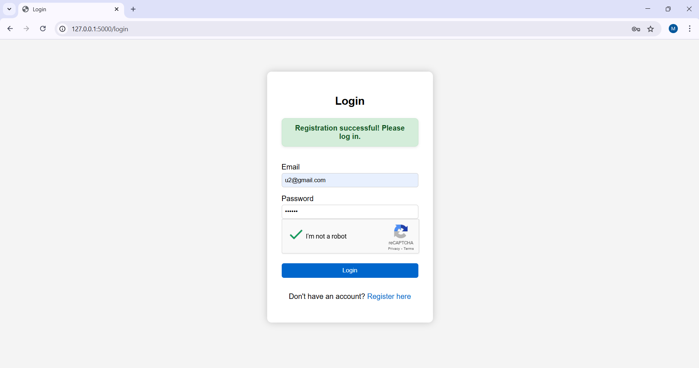
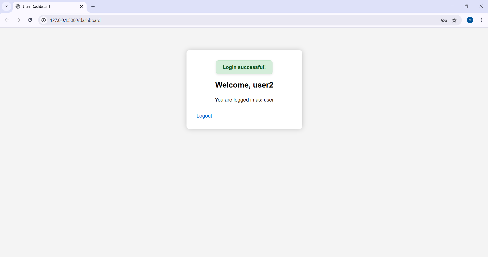

# 🔐 Secure Login System with Role-Based Access Control (RBAC)
## 📌 Project Overview
A secure web-based login and registration system built using **Flask**, **SQLite**, and **bcrypt**, with **Role-Based Access Control** (RBAC) for Admin and User roles. The project includes security features like input validation, CAPTCHA, account lockout, and session handling.

---

## 🛠️ Tech Stack
- **Backend:** Flask (Python)
- **Database:** SQLite + SQLAlchemy
- **Frontend:** HTML, CSS
- **Security:** bcrypt, Flask sessions, Google reCAPTCHA
- **Role Management:** Admin/User-based access control

---

## 🚀 Features

✅ User Registration  
✅ User Login  
✅ Admin/User Role Assignment  
✅ Dashboard Based on Role  
✅ Password Hashing with bcrypt  
✅ reCAPTCHA Integration  
✅ Account Lockout after 5 Failed Attempts  
✅ Access Control with Flash Messages

---

## 🧪 Test Accounts

| Email | Password | Role  |
|-------|----------|-------|
| admin@example.com | admin123 | Admin |
| u1@example.com    | u1@123   | User  |

---

## 📸 Screenshots

| Feature | Screenshot |
|--------|------------|
| Registration Page |  |
| Login Page |  |
| Admin Dashboard |  |
| User Dashboard |  |

---

## 📂 Project Structure

project/
├── app.py
├── models.py
├── config.py
├── templates/
│ ├── login.html
│ ├── register.html
│ ├── dashboard_admin.html
│ ├── dashboard_user.html
│ └── admin_users.html
├── static/
│ └── styles.css
├── database.db


---

## 🧑‍💻 Local Setup Instructions

1. **Clone the repo:**
   ```bash
   git clone https://github.com/yourusername/secure-login-system.git
   cd secure-login-system
   
2. **Create a virtual environment and activate it:**
   python -m venv venv
   venv\Scripts\activate  # on Windows
   
3. **Install dependencies:**
   pip install -r requirements.txt
   
4. **Run the application:**
   flask run
   
5. **Open your browser at:**
   http://127.0.0.1:5000

## ⚠️ Known Issues / Improvements
- Reset password not implemented
- CAPTCHA can be bypassed (for now)
- No email verification

## 🙋‍♂️ Challenges Faced
- CAPTCHA integration and validation
- Securing user sessions correctly
- Showing flash messages consistently across all templates
- Proper routing for role-based dashboards

## 💡 Future Enhancements
- Implement password reset
- Add email verification during registration
- Enable 2FA for Admins
- Store logs for failed login attempts
   
## 📧 Contact
- If you have questions or feedback, feel free to reach out!

## ⭐ If you found this useful, consider giving it a star on GitHub!


